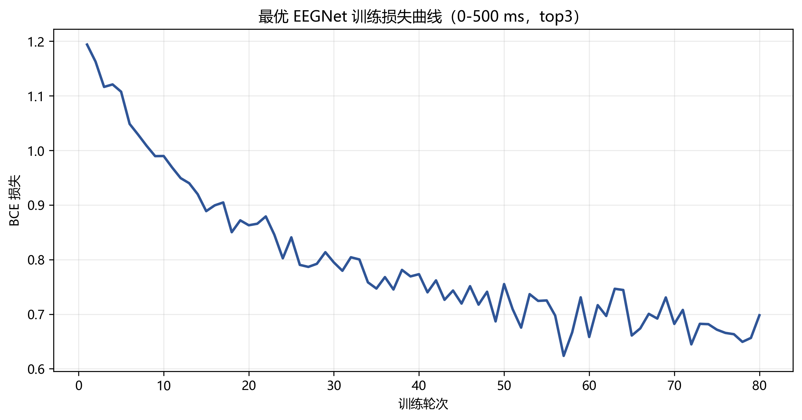
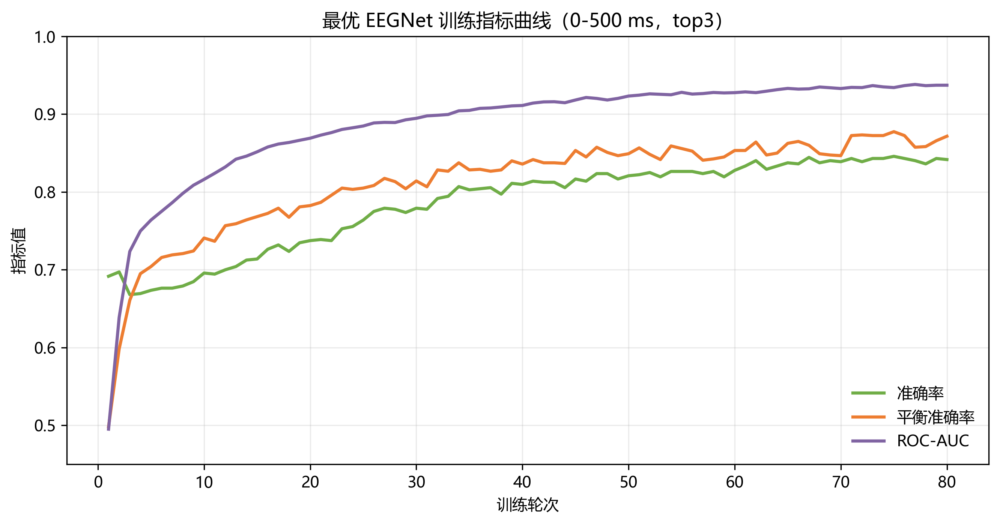

# P300 字符识别实验结果

## 预处理与建模

- 原始采样率: 250 Hz
- 降采样: 2 倍，建模采样率 125 Hz
- 带通滤波: 0.5-30 Hz
- 基线校正: 事件前 0.2 s
- 特征/模型: eegnet 直接学习 通道 x 时间 的卷积特征 (epochs=80, lr=0.001, dropout=0.5, pos_weight_scale=1)
- 字符聚合: top3
- 验证: 12 个训练字符做 Leave-One-Character-Out 交叉验证

## 最优配置

- 模型: eegnet
- 响应窗口: 0-500ms (62 samples)
- 字符级验证准确率: 0.8333
- 事件级 Balanced Accuracy: 0.7600
- 事件级 ROC-AUC: 0.8245

## 参数记录

复现命令：

```powershell
python ".\EEGNet_0_500_top3\src\p300_pipeline.py" --data-dir "..\..\..\大作业\P300-S1" --output-dir ".\EEGNet_0_500_top3" --models eegnet --epoch-ms 0-500 --aggregate-method top3
```

与 LDA 优化探索统一口径的参数记录：

| 参数 | 设置 |
|---|---|
| 时间窗口 | `0-500 ms` |
| 通道模式 | 全通道，20 channels |
| 时间分箱 | 不使用显式 bins，EEGNet 直接输入 `62` 个时间采样点 |
| 特征标准化 | EEGNet 内部按训练集计算均值和标准差后标准化 |
| 模型 | EEGNet 二分类模型 |
| 类别权重/先验 | `pos_weight_scale=1.0`，损失函数中正类权重按训练集正负样本比例自动计算 |
| 字符聚合 | `top3` |
| 验证方式 | 12 个训练字符 leave-one-character-out |
| 字符选择 | 每个字符选择得分最高的行和列，再映射为字符 |

EEGNet 具体训练参数：

| 参数 | 设置 |
|---|---:|
| 原始采样率 | 250 Hz |
| 降采样倍数 | 2 |
| 建模采样率 | 125 Hz |
| 带通滤波 | 0.5-30 Hz |
| 基线校正 | 事件前 0.2 s |
| 响应采样点数 | 62 |
| 训练轮数 | 80 |
| batch size | 64 |
| 学习率 | 0.001 |
| weight decay | 0.001 |
| dropout | 0.5 |
| 随机种子 | 42 |
| scheduler | 关闭 |
| F1 | 8 |
| D | 2 |
| F2 | 16 |
| 输入形状 | 20 通道 x 62 时间点 |

## EEGNet 训练过程

最优 EEGNet 配置在全部训练字符上重训 80 个 epoch，并记录每轮训练集 BCE loss、Accuracy、Balanced Accuracy 和 ROC-AUC。

训练损失曲线：



训练指标曲线：



## Unknown 预测

- Unknown1 = 2 (字符置信度=0.106, 行概率=0.323, 列概率=0.328, 行得分=0.804, 列得分=0.905, 行margin=0.111, 列margin=0.441)
- Unknown2 = T (字符置信度=0.087, 行概率=0.235, 列概率=0.373, 行得分=0.778, 列得分=0.838, 行margin=0.003, 列margin=0.375)
- Unknown3 = F (字符置信度=0.095, 行概率=0.303, 列概率=0.314, 行得分=0.834, 列得分=0.910, 行margin=0.001, 列margin=0.410)
- Unknown4 = 5 (字符置信度=0.125, 行概率=0.354, 列概率=0.352, 行得分=0.635, 列得分=0.897, 行margin=0.223, 列margin=0.423)
- Unknown5 = I (字符置信度=0.095, 行概率=0.217, 列概率=0.436, 行得分=0.603, 列得分=0.964, 行margin=0.018, 列margin=0.664)
- Unknown6 = L (字符置信度=0.060, 行概率=0.203, 列概率=0.295, 行得分=0.542, 列得分=0.964, 行margin=0.027, 列margin=0.290)
- Unknown7 = K (字符置信度=0.069, 行概率=0.234, 列概率=0.293, 行得分=0.728, 列得分=0.947, 行margin=0.049, 列margin=0.267)
- Unknown8 = M (字符置信度=0.105, 行概率=0.318, 列概率=0.329, 行得分=0.897, 列得分=0.955, 行margin=0.310, 列margin=0.380)

## 输出文件

- validation_results.csv: 不同模型和窗口的交叉验证指标
- validation_char_predictions.csv: 留一字符验证的字符级预测明细
- test_predictions.csv: 8 个 Unknown 的最终预测
- test_event_scores.csv: 测试集每个闪烁事件的模型得分
- model.pkl: 使用全部训练字符重训后的最终模型
- tables/eegnet_training_history.csv: 最优 EEGNet 每轮训练指标
- figures/eegnet_training_loss.png: 最优 EEGNet 训练损失曲线图
- figures/eegnet_training_metrics.png: 最优 EEGNet 训练指标曲线图
- scripts/plot_eegnet_training.py: 最优 EEGNet 训练过程绘图脚本

